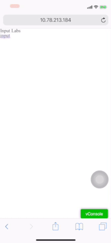
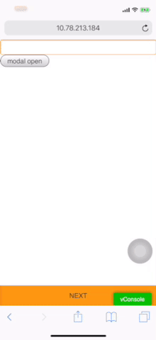
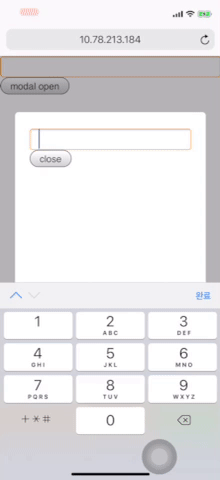
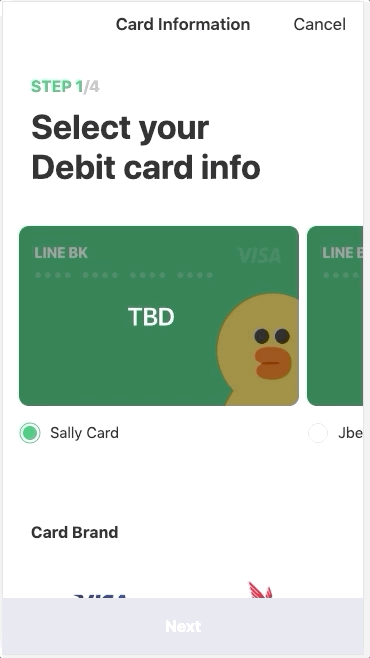
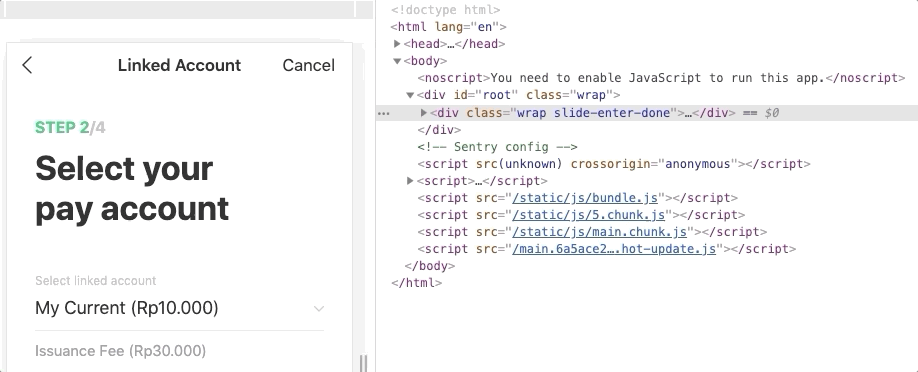

# UX-Lab

이게 웹이야? 하는 그날까지 🚀

### Table of Contents

- [Phase 1. War of Input](#phase-1-War-of-Input-tag)
- [Phase 2. App Like Animation](phase-2-app-like-animation')

# Phase 1. War of Input tag

Webview에서 input과 관련하여 맞딱뜨린 이슈들을 정리한다. 기본적으로 input 태그를 클릭하면 키패드가 올라온다. 그리고 그 때부터 UX 담당자 분들과의 불협화음이 시작된다.

## Q1. 키패드 위에 버튼을 둘 수 있나요?

하단에 fixed position으로 button이 있는 상황을 가정하자. 하단에 fixed position으로 줬으니 이 버튼은 키패드 바로 위쪽에 붙어있기를 기대하기 마련이다.

**하지만,**

### iOS

- 하단 버튼을 덮으면서 키패드가 올라온다.
- 그리고 스크롤이 없었다가 스크롤이 발생한다.
  - 즉 화면에서 보이는 영역이 viewport보다 작아졌다고 인식을 하게 된다.

### AND

- 기대한 것처럼 키패드 바로 위쪽에 붙어있는다.
- 그리고 스크롤도 발생하지 않는다.
  - 즉 viewport를 화면에서 보이는 영역으로 잡는다.

## Q2. 화면으로 진입하자마자 키패드를 띄울 수 있나요?

한 화면에 input tag 하나만 존재하는 경우가 있을 수 있다. 보통 이럴 경우 화면에 진입하자마자 키패드를 띄우면 사용성이 증대될 것이다. 사용자가 input 태그를 한 번 더 클릭하여 키패드를 띄우는 것보다 action이 하나 줄어들기 때문이다.

이 요구 사항은 iOS, AND 둘 다 `autoFocus={true}`를 주면 된다.

→ 특정 모달 안에 있는 input도 가능하다! 즉 모달이 노출됨과 동시에 키패드를 띄울 수 있다.




## Q3. 키패드 바깥 부분을 클릭해도 키패드가 내려가지 않도록 할 수 있나요?

### Try 1. `onBlur` 이벤트 발생 시, focus를 강제한다.

- 키패드에 있는 '완료' 버튼을 클릭하더라도 닫히지 않아서 onBlur를 건드릴 수 없다.

### Try 2. 특정 target을 잡은 후, focus를 강제한다.

- 특정 target이 여러개 일 경우, 전부 click handler를 등록해줘야 한다.
- 이 방식으로 가능은 하지만, 코드로 focus를 강제해줄 경우, 커서 깜빡임이 사라진다.



## Case 4. 키패드에 영향받지 않고 정중앙 위치

- 모달의 크기에 따라 다르겠지만...
  - iOS인 경우에는 viewport를 조정하지 않기 때문에 키패드가 올라오기 전과 동일하다.
    - 즉 키패드가 없는 경우를 키패드 올라왔을 경우의 정중앙으로 위치시키면 vertical 중앙에 위치시킬 수 있다.
  - AND의 경우에는 디바이스에서 viewport를 조정하기 때문에 적당한 위치로 알아서 조정한다.

<br />

# Phase 2. App Like Animation

App에서는 화면 간 이동 시, 부드러운 애니메이션과 함께 transition 같은 것이 진행된다. 웹에서도 해보자.


<div align='center'>



Drawer

</div>

<div align='center'>


Pagination

</div>

# 애니메이션?

<div align='center'>


네이버 스마트어라운드 서비스

</div>

## 기본적인 Toggle 동작 (non-animation)

1. A 클릭 → A: `display: none`
2. B: `display: block`

## With Animation

결국 사라지지만 애니메이션 동안 그 형태를 유지하며 애니메이션을 노출한다. (잔상)

1. A 클릭
2. A가 사라지기 전에 **clone ⇒ A'**
3. A 사라짐
4. B가 렌더링 되지만 보이지 않도록 한다.
5. A' 애니메이션과 함께 사라지기
6. A' 애니메이션이 끝날 때, B가 애니메이션과 함께 노출되기
7. Clone 된 A' 삭제

## 핵심

- Clone
- 애니메이션이 시작하는 시점과 끝나는 시점 컨트롤

### Code

- keyframes (or transition)
- `animationstart/animationend` event (`transitionstart/transitionend` event)
- Promise (control async)

> keyframes 다루는 hepler

### Start Animation

```
const animate = (props: AnimationProp) => {
  return new Promise((resolve, reject) => {
    // Animation Start
    target.addEventListener("animationend", onAnimationEnd);
    target.classList.add(className);
  })
}

```

<small>https://github.com/JaeYeopHan/animation-helper/blob/master/src/index.ts</small>

## react-transition-group

[reactjs/react-transition-group](https://github.com/reactjs/react-transition-group)

React 유틸 라이브러리 중 위에서 언급한 핵심 역할을 해주는 라이브러리

> 사용해보신 분은 아시겠지만 공식 문서가 매우 불친절...🤬

### 해주는 역할은 딱 2가지

- children을 clone하여 prev와 next를 둘 다 렌더링
- 렌더링 시점에서 life cycle을 추가하여 class selector를 붙였다 뗐다 함.

### Inspect



### 1. Clone Element

- prev element
- next element

### 2. Life Cycle (with selector)

- next element
  - `*-enter` (ready)
  - `*-enter-active` (trigger)
  - `*-enter-done` (done)
- prev element
  - `*-exit` (ready)
  - `*-exit-active` (trigger)
  - `*-exit-done` (done)

+`*`에는 prefix

### 장점

애니메이션의 Life cycle을 사용하여 `animationend` 또는 `transitionend` 이벤트를 알 필요가 없다.

즉, Life Cycle 에 따라 추가되고 제거되는 CSS Selector에 알맞은 스타일만 추가해주면 된다.

### 몇 가지 한계점

1. 스마트어라운드에서 했던 keyframes 기반의 복잡한 애니메이션은 한계가 있음.
2. transition을 적용할 element에 timeout을 여러 가지 둘 수 없다.

## Code

> Talk is cheap. show code.

### Drawer Transition Container

```ts
import React, { ReactChild } from 'react'
import { CSSTransition } from 'react-transition-group'

interface IDrawerTransitionProps {
  children: ReactChild | ReactChild[]
  in: boolean
}

export const DrawerTransition = (props: IDrawerTransitionProps) => {
  return (
    <CSSTransition timeout={400} in={props.in} classNames={'drawer'}>
      {props.children}
    </CSSTransition>
  )
}
```

### Transition Styles

```css
/* DRAWER TRANSITION */
.drawer-enter {
  transform: translate3d(0, 100%, 0);
}
.drawer-enter-active {
  transform: translate3d(0, 0, 0);
  transition: transform 400ms;
}
.drawer-exit {
  transform: translate3d(0, 0, 0);
}
.drawer-exit-active {
  transform: translate3d(0, 100%, 0);
  transition: transform 400ms;
}
```

### 추가적으로 고려했던 Detail

- 뒤로 가기 시에는 reverse transition
- Parallax Effect
- Opacity와 transform 시간 차이

(애니메이션을 비롯한 UX 연구는 계속 진행 중 🤟)

<small>

<a href="https://github.com/JaeYeopHan/ux-lab">https://github.com/JaeYeopHan/ux-lab</a>

</small>

<div align="center">

<sub><sup>Project by <a href="https://github.com/JaeYeopHan">@Jbee</a></sup></sub><small>✌</small>

</div>
